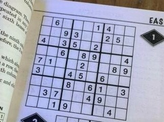
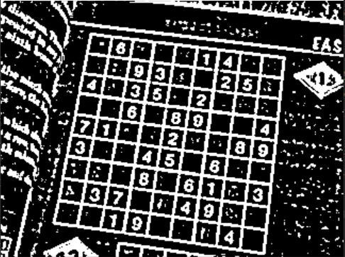
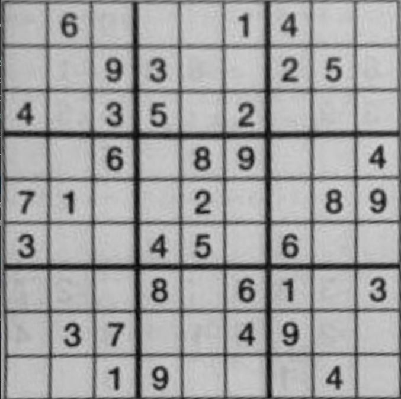
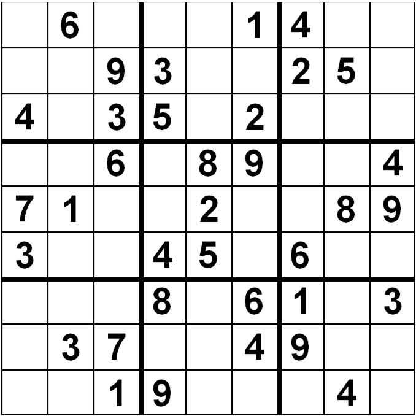
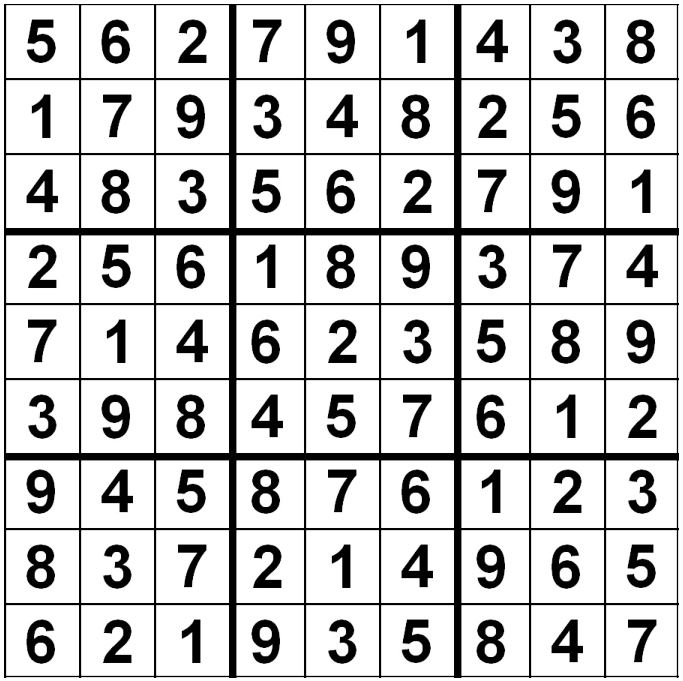

# Sudoku solver
This project aims at solving a Sudoku from a picture, which might have a poor quality (blurred, not upright, small...).

Here is an example of a Sudoku solved with our algorithm.

<div align="center"> Input Sudoku picture.
</div>
<p align="center">
    
</p>

<div align="center"> After preprocessing, we get a binary image, to be able to extract the grid from the picture.
</div>
<p align="center">
    
</p>

<div align="center"> Cropped Sudoku grid.
</div>
<p align="center">
    
</p>


<div align="center"> Generated grid, after digits recognition.
</div>
<p align="center">
    
</p>

<div align="center"> The finally solved Sudoku.
</div>
<p align="center">
    
</p>


## How to run the project
Run the main file. The input `.jpg` file has to be in `data/` folder.
```bash
python main.py --input_file test4.jpg
```

## Prerequisites and Installation
Run the following command
```bash
conda create -n sudokuenv
```
```bash
conda activate sudokuenv
```
```bash
conda install pip
```
```bash
pip install -r requirements.txt
```

## Sources
Digits dataset found at : https://www.kaggle.com/datasets/preatcher/standard-fonts-digit-dataset-09?resource=download

## Contributors
Maxime Brisinger