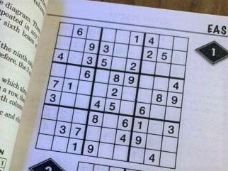
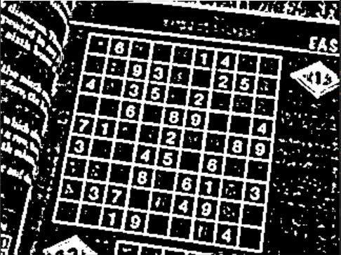
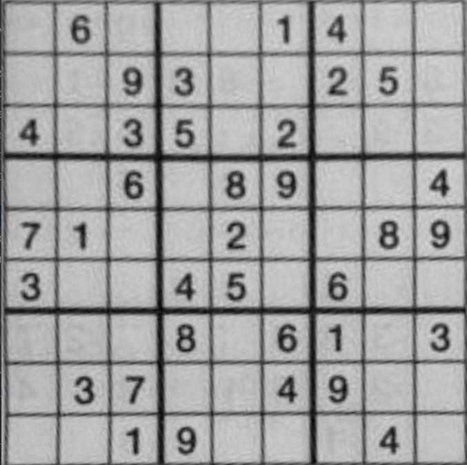
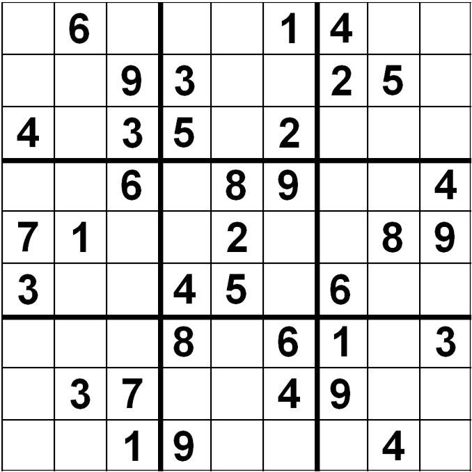
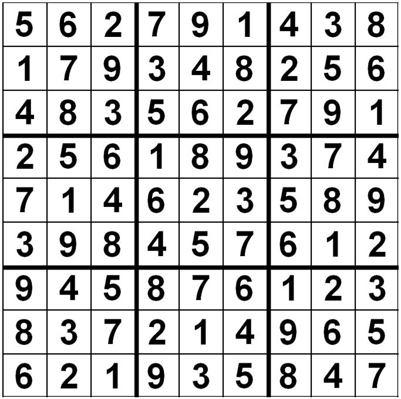

# Sudoku solver
This project aims at solving a Sudoku from a picture, which might have a poor quality (blurred, not upright, small...).

**Here is an example of a Sudoku solved with our algorithm.**

<div align="center"> Input Sudoku picture.
</div>
<p align="center">
    
</p>

<div align="center"> After preprocessing, we get a binary image, to be able to extract the grid from the picture.
</div>
<p align="center">
    
</p>

<div align="center"> Cropped Sudoku grid.
</div>
<p align="center">
    
</p>


<div align="center"> Generated grid, after digits recognition.
</div>
<p align="center">
    
</p>

<div align="center"> The finally solved Sudoku.
</div>
<p align="center">
    
</p>


## <a name="ref" How to run the project />
Run the main file. The input `.jpg` file has to be in `data/` folder.
```bash
python main.py --input_file example1.jpg
```
*Optional argument* : add `--verbose` to print solver indicators at the end of the execution.


* A first window will open, which shows you the cropped image, with only the sudoku grid left. You need to close it for the run to continue.
* Then, a new window with the predicted grid opens. If some digits are wrong, click on the corresponding cell(s) and then enter the true value (instructions are printed in the terminal). Once your modifications are done, you can close the window.
* If you edited at least one cell, the corrected grid will appear. You need to close it for the run to continue.
* Finally, the solved grid will appear.

## Prerequisites and Installation
Run the following command
```bash
conda create -n sudokuenv
```
```bash
conda activate sudokuenv
```
```bash
conda install pip
```
```bash
pip install -r requirements.txt
```

## Sources
Digits dataset found at : https://www.kaggle.com/datasets/preatcher/standard-fonts-digit-dataset-09?resource=download

## Contributors
Maxime Brisinger